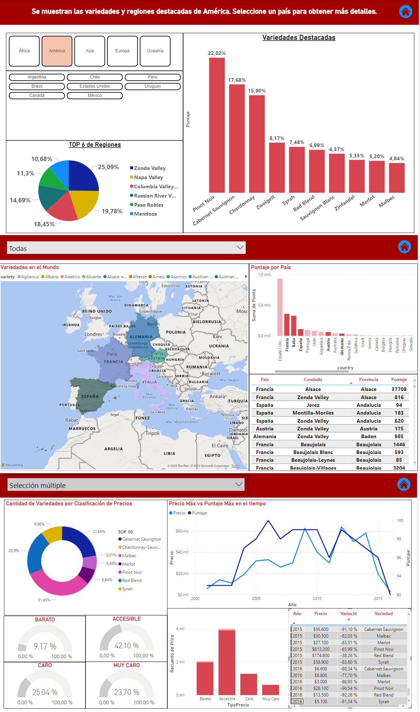

## Laboratorio de Análisis Clínicos
Dashboard de un laboratorio de análisis clínicos, conectado con una base de datos SQLite. Se analiza a través del tiempo el movimiento de pacientes, edad promedio y meses con mayor actividad, pero puntualmente se hace foco en lo siguiente:
- Cuáles son las obras sociales con las que más se trabaja.
- Cuáles son los tipos de análisis qué más se realiza la gente y en virtud a ello se destina la compra de insumos.
- En relación a lo anterior, qué estudios conviene derivar y cuáles no.  

## Análisis de Vinos por Variedad, Precio y Región
Implementé este dashboard para un curso de Data Analytics. A partir de un dataset se aplicaron técnicas de ETL y, en función de los requerimientos, se generaron las visualizaciones necesarias. Se puede analizar una variedad particular de vino en función del precio y su evolución con los años. También se puede comparar contra otras variedades o regiones del mundo.

